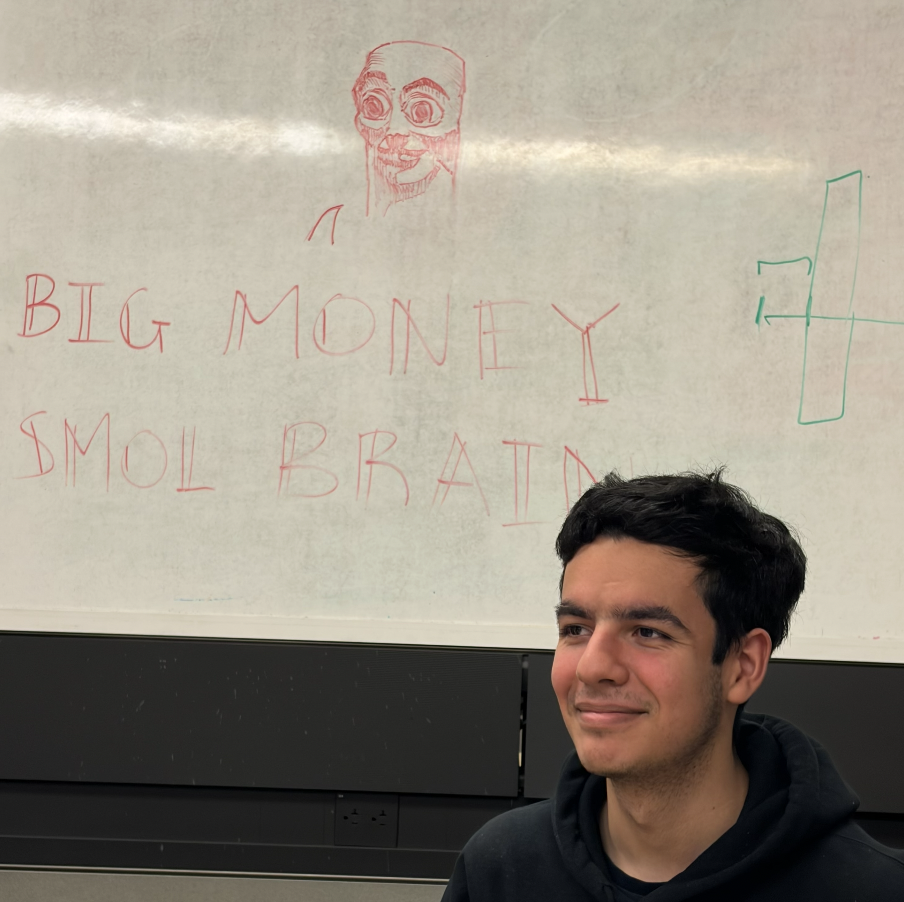

<!--  -->

    
Camarón que se duerme, se lo lleva la corriente.

    

    I'm an MIT undergraduate in the department of Aeronautics and Astronautics. My interests lie in satellite and systems engineering. When I'm not working on psets I love to work out with my buddies and speedcube.
    

{: .container .ratio .ratio-1x1 .object-fit-cover .rounded-circle .img-fluid .d-block .mx-auto style='width: 350px;'}
<!--  -->
